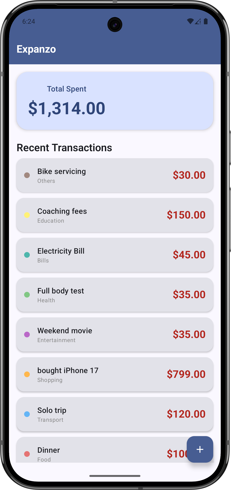
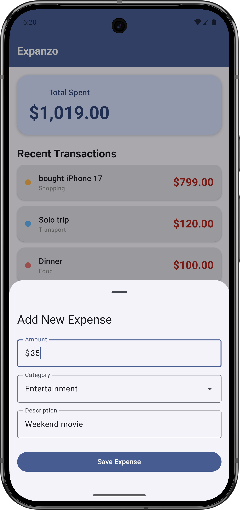

# Expanzo - Personal Expense Tracker

Expanzo is a streamlined personal finance application designed to help users monitor their spending with ease. It emphasizes a clean, Material 3 aesthetic with a focus on financial clarity and intuitive interaction.

## Features

*   **Total Spent Dashboard**: A prominent card at the top of the main screen providing an immediate overview of total expenditures.
*   **Recent Transactions List**: A scrollable history of expenses featuring category-specific color-coding for quick visual identification.
*   **Quick Add Expense**: A Floating Action Button (FAB) that triggers a Material 3 Bottom Sheet, allowing users to rapidly log new transactions.
*   **Adaptive & Edge-to-Edge UI**: A modern interface that supports full edge-to-edge display and includes an adaptive app icon to match the system's design.

## Screenshots

<p align="center">
  
  
</p>

## Tech Stack

*   **Kotlin**: The primary programming language for robust and concise development.
*   **Jetpack Compose**: A modern toolkit for building native, declarative UI with Material 3 components.
*   **Room**: For local data persistence and offline support.
*   **Kotlin Coroutines**: For managing asynchronous tasks and ensuring a smooth, non-blocking user experience.
*   **KSP (Kotlin Symbol Processing)**: Used for efficient code generation, replacing KAPT.
*   **Material 3**: Implementation of dynamic light and dark themes using Material 3 color utilities and expressive components.

## Getting Started

To get a local copy up and running, follow these simple steps:

1.  **Clone the repo**
    ```sh
    git clone https://github.com/your-username/Expanzo.git
    ```
2.  **Open in Android Studio**
    *   Open Android Studio and select `Open`.
    *   Navigate to the cloned directory and select it.
3.  **Run the project**
    *   Sync Gradle and build the project.
    *   Run the app on an emulator or a physical device.

---
*Developed with a "financial" light-green motif and Material Design 3 principles.*
